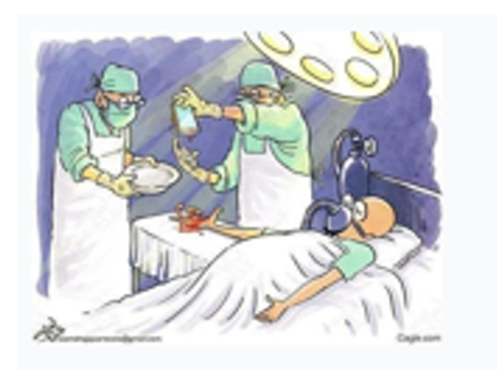
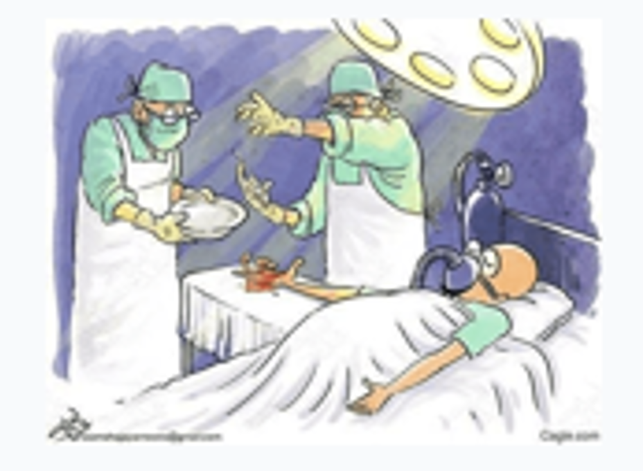
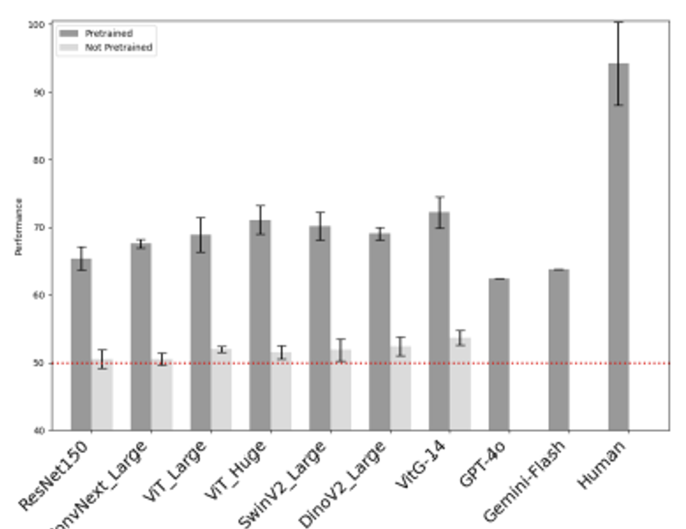
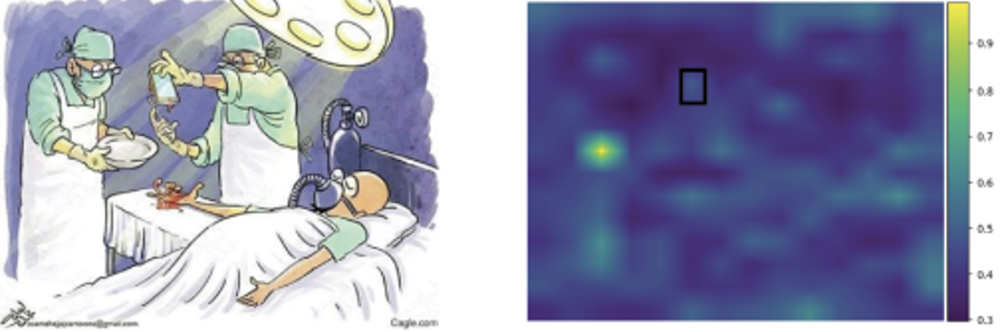
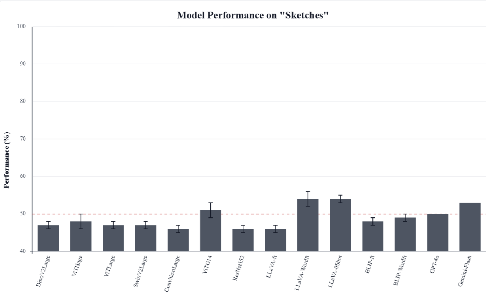
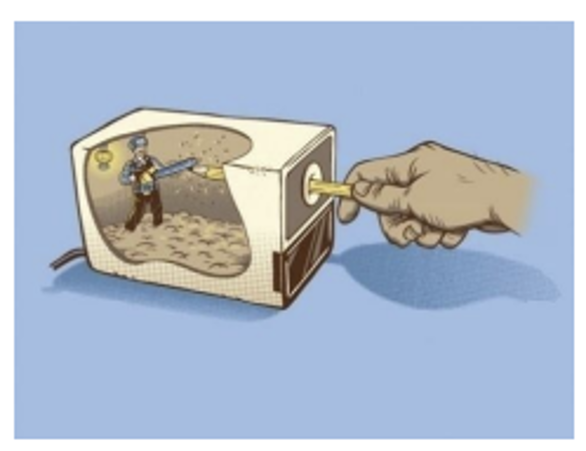

## HumorDB: Can AI Understand Graphical Humor?

**Authors:** [Vedaant V Jain](/), Felipe dos Santos Alves Feitosa, Gabriel Kreiman
<br>
*In Proceedings of the IEEE/CVF International Conference on Computer Vision (ICCV), 2025*

<div class="buttons" style="text-align: center; margin-top: 20px; margin-bottom: 20px;">
    <a href="https://arxiv.org/abs/2406.13564" class="btn btn-lg z-depth-0" role="button">Paper (ArXiv)</a>
    <a href="[LINK_TO_YOUR_POSTER_FILE]" class="btn btn-lg z-depth-0" role="button">Poster</a>
    <a href="https://github.com/kreimanlab/HumorDB" class="btn btn-lg z-depth-0" role="button">Code & Dataset</a>
</div>

---

### The Core Idea: What does it mean to "understand" an image?

Modern AI can easily label the objects in the images below: "surgeon," "patient," "operating room". But can it tell you *why* the image on the left is funny, while the nearly identical image on the right is not?

This is the central question of HumorDB. We find that while AI is good at literal-level *classification*, it fails at human-level *abstract reasoning*. Humor, which relies on understanding context, expectations, and incongruity, is the perfect testbed for this.

We introduce **HumorDB**, a new dataset and benchmark built on **minimally contrastive pairs**. We take a humorous image and make a subtle edit to remove *only* the humorous element, forcing the model to prove it can pinpoint the exact source of the joke.

<div class="row" style="margin-top: 20px; margin-bottom: 20px;">
    <div class="col-sm mt-3 mt-md-0" style="text-align: center;">
        
        <p><strong>Funny</strong> (83% of humans agree)</p>
    </div>
    <div class="col-sm mt-3 mt-md-0" style="text-align: center;">
        
        <p><strong>Not Funny</strong> (86% of humans agree) </p>
    </div>
</div>

---

### Key Findings at a Glance

We tested state-of-the-art vision models (ViT, DINOv2) and large vision-language models (GPT-4o, Gemini-Flash) against human performance on three tasks: binary classification, funniness rating, and pairwise comparison (which image is funnier).

<div class="row" style="margin-top: 20px;">
    <div class="col-sm mt-3 mt-md-0">
        <strong>1. A Clear Human-AI Gap Remains</strong>
        <br>
        <p>Models perform well above chance, but all trail human-level accuracy. The gap is most pronounced in the "Comparison Task," which requires nuanced judgment.</p>
        
    </div>
    <div class="col-sm mt-3 mt-md-0">
        <strong>2. AI Fails to "Look at the Joke"</strong>
        <br>
        <p>Even when a model is correct, its internal attention maps rarely focus on the humorous region. Models are "right for the wrong reason," relying on superficial cues, not the joke itself.</p>
        
    </div>
    <div class="col-sm mt-3 mt-md-0">
        <strong>3. Abstraction is the Hardest Challenge</strong>
        <br>
        <p>Performance varied by image type. All models struggled most with abstract content like sketches, performing near chance-level.</p>
        
    </div>
</div>

---

### The Dataset

HumorDB is a diverse, controlled dataset designed for rigorous evaluation.

* **3,542** Total Images
* **1,271** Minimally Contrastive Pairs
* **650** Human Subjects Annotating
* **5 Image Types:** Photos (36%), Photoshopped (35%), Cartoons (14%), Sketches (5%), and AI-Generated (10%)

#### Examples from HumorDB

<div class="row">
    <div class="col-sm mt-3 mt-md-0">
        
        <p style="color: red;"><i>GPT-4o: "...the optical illusion created by the shadow...makes it appear as though someone is flying on a magic carpet."</i></p>
    </div>
    <div class="col-sm mt-3 mt-md-0">
        
        <p style="color: green;"><i>Gemini-Flash: "...the dog is wearing sunglasses and enjoying a coconut drink."</i></p>
    </div>
    <div class="col-sm mt-3 mt-md-0">
        
        <p style="color: red;"><i>Llava: "...depicts a cartoon of a person inside a box, seemingly being ”pulled out” by a hand using a toothpick. ..."</i> </p>
    </div>
</div>

---

### Abstract
> Despite significant advancements in image segmentation and object detection, understanding complex scenes remains a significant challenge. Here, we focus on graphical humor as a paradigmatic example of image interpretation that requires elucidating the interaction of different scene elements in the context of prior cognitive knowledge. This paper introduces HumorDB, a novel, controlled, and carefully curated dataset designed to evaluate and advance visual humor understanding by AI systems. The dataset comprises diverse images spanning photos, cartoons, sketches, and AI-generated content, including minimally contrastive pairs where subtle edits differentiate between humorous and non-humorous versions. We evaluate humans, state-of-the-art vision models, and large vision-language models on three tasks: binary humor classification, funniness rating prediction, and pairwise humor comparison. The results reveal a gap between current AI systems and human-level humor understanding. While pretrained vision-language models perform better than vision-only models, they still struggle with abstract sketches and subtle humor cues. Analysis of attention maps shows that even when models correctly classify humorous images, they often fail to focus on the precise regions that make the image funny. Preliminary mechanistic interpretability studies and evaluation of model explanations provide initial insights into how different architectures process humor. Our results identify promising trends and current limitations, suggesting that an effective understanding of visual humor requires sophisticated architectures capable of detecting subtle contextual features and bridging the gap between visual perception and abstract reasoning. All the code and data are available here: https://github.com/kreimanlab/HumorDB.

---

### Citation
If you find our work useful, please consider citing:


```bibtex
@misc{jain2025humordbaiunderstandgraphical,
      title={HumorDB: Can AI understand graphical humor?}, 
      author={Vedaant V Jain and Felipe dos Santos Alves Feitosa and Gabriel Kreiman},
      year={2025},
      eprint={2406.13564},
      archivePrefix={arXiv},
      primaryClass={cs.CV},
      url={[https://arxiv.org/abs/2406.13564](https://arxiv.org/abs/2406.13564)}, 
}
```